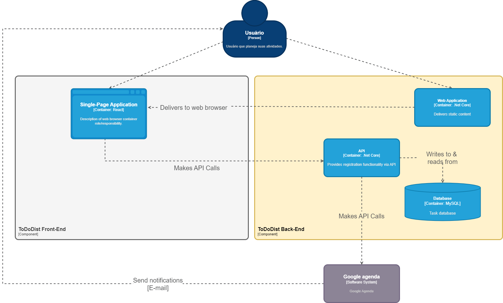

# Diagrama de Componentes

> Elabore o diagrama de componentes utilizando a notação C4. O diagrama de componentes mostra como um contêiner é composto por vários "componentes", o que são cada um desses componentes, suas responsabilidades e os detalhes de tecnologia/implementação.

 