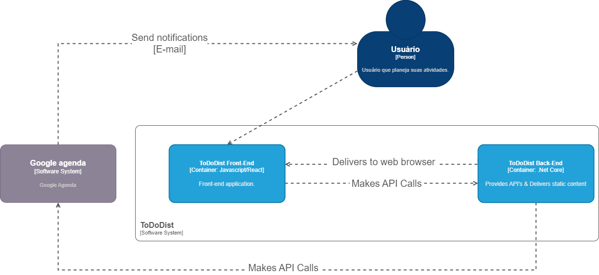

# Diagrama de Contêiner

> Elabore o diagrama de contêiner utilizando a notação C4. Esse diagrama mostra uma visão de alto nível da arquitetura de software e como as responsabilidades são distribuídas nela. Ele também mostra as principais opções de tecnológicas e como os contêineres se comunicam entre si.

